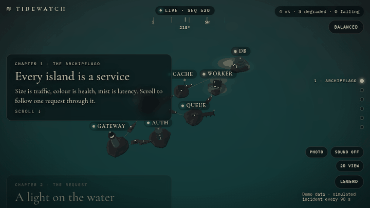
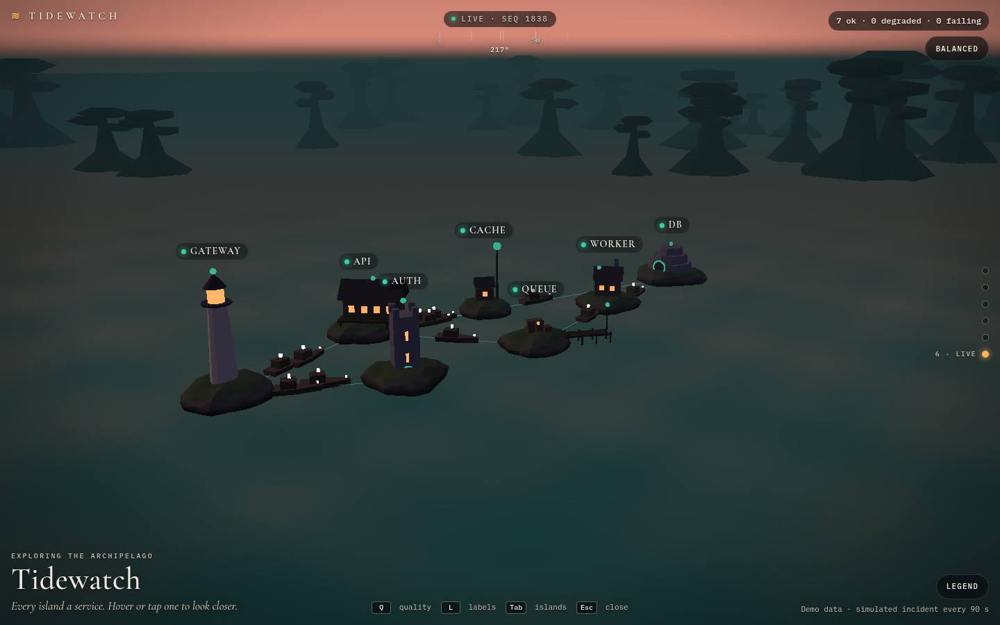
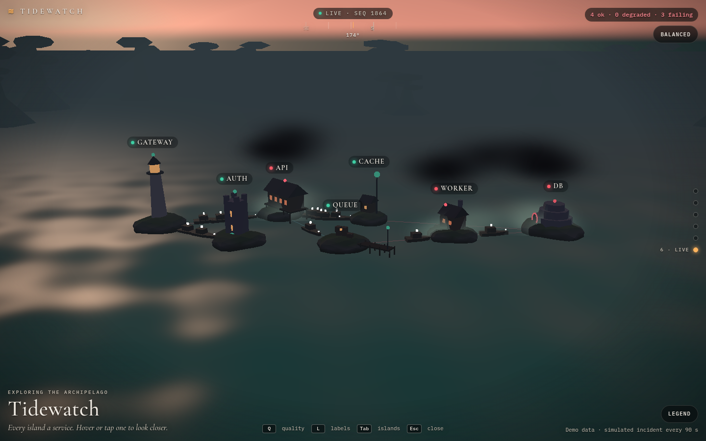
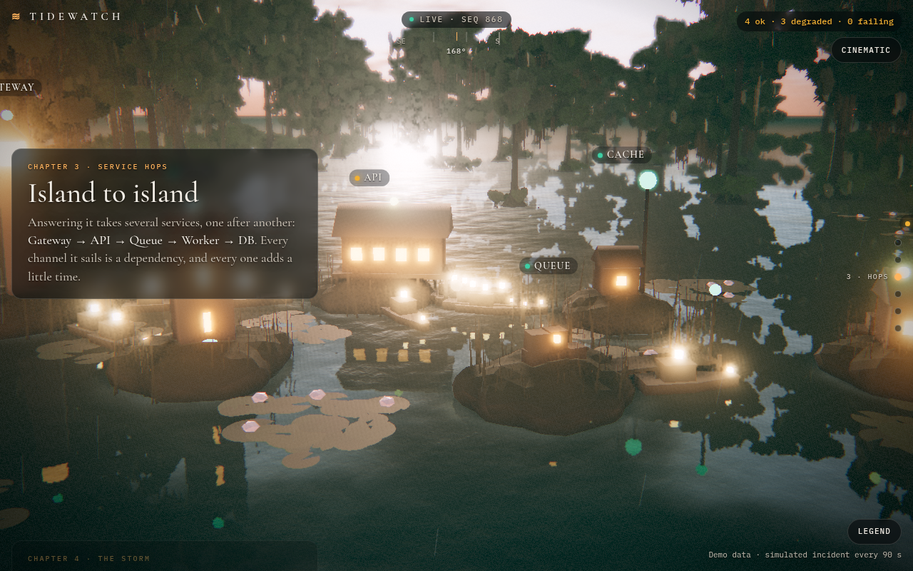
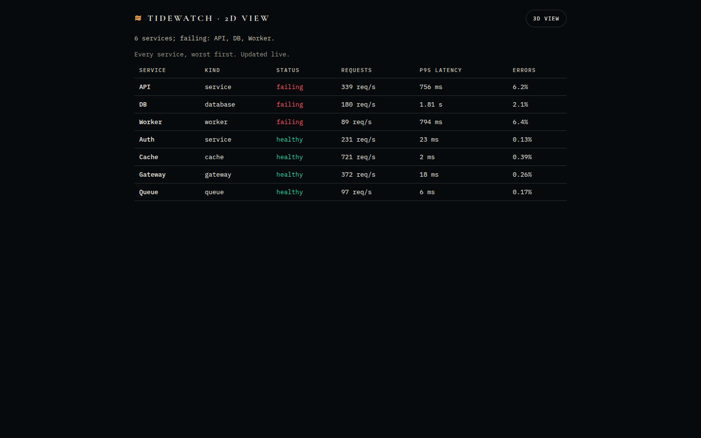

# Tidewatch

**A cinematic, scroll-driven 3D world that shows your infrastructure live.**
Services are islands, requests are ships of light, latency is fog and storms, errors flash red.
FastAPI streams the metrics over a hardened WebSocket; Three.js renders them; it is designed to
stay smooth on low-end devices.



> Status: **v0.1.0 candidate** (M0-M6 built; M2-M6 in review). What is and is not verified is
> listed in [`docs/HANDOVER.md`](docs/HANDOVER.md).

## What you get

- **A scroll film** (six chapters): the archipelago from above, one request arriving at the
  lighthouse and hopping along the real route, the slow island, the failure, then the live view.
  Plain anchors (`/#live`), keyboard and screen-reader friendly; `prefers-reduced-motion` cuts
  between stills instead of gliding.
- **Weather from the data**: latency thickens the mist, failing services gather storms and
  lightning, requests into an erroring service sink on the way.
- **Live view**: fly the camera (drag, WASD, pinch), click any island for its numbers, an event
  feed of status changes, photo mode (P), optional procedural sound (off by default).
- **Three quality tiers** (Cinematic, Balanced, Simple) picked per device and adjusted by an FPS
  governor, and a **2D table view** for devices without WebGL (or `?view=2d`).
- **Real data**: a tiny metrics add-on for your own apps (`addons/`, Node or ASGI), polled only
  while someone watches; demo data by default.

| Balanced, calm | Balanced, incident | Cinematic | 2D view |
| --- | --- | --- | --- |
|  |  |  |  |

## Why it exists

Monitoring dashboards are useful and dull. Tidewatch keeps the usefulness (real service health,
latency, error rates, topology) and makes it something people want to look at: a scroll-driven
story that explains a request's journey and an incident, then unlocks into a free-fly live view.

## Quick start (local, demo data, no credentials)

```bash
# backend  (Python 3.11+)
cd backend
python -m venv .venv && source .venv/bin/activate
pip install -e ".[dev]"
pytest
uvicorn app.main:get_app --factory --reload --port 8000

# frontend (Node 22.12+)  - in a second terminal
cd frontend
npm ci --ignore-scripts
npm run dev        # http://localhost:5173  (proxies /api and /ws to :8000)
```

## Repository map

| Path | What |
| --- | --- |
| `backend/` | FastAPI app: config, security primitives, demo source, WebSocket hub, tests |
| `frontend/` | Vite + TypeScript + Three.js client: protocol validation, the film, tiers, live view, 2D view |
| `addons/` | The metrics add-on your apps serve (Node/Express and ASGI), and its contract |
| `deploy/` | Caddy (TLS, CSP, single origin) + hardened docker-compose; `deploy/render/` for Render |
| `docs/PLAN.md` | Vision, storyboard, milestones with acceptance criteria |
| `docs/ARCHITECTURE.md` | Components, WebSocket protocol, scene/scroll design, live adapters |
| `docs/SECURITY.md` | Threat model, controls per layer, launch checklist, residual risks |
| `docs/PERFORMANCE.md` | Budgets, quality tiers, measurement |
| `docs/HANDOVER.md` | **Start here if you are Claude Code / a new contributor** |
| `CLAUDE.md` | Rules and commands for Claude Code |
| `scripts/` | `publish.sh` / `harden-repo.sh` (GitHub repo + security settings), `lock-backend.sh` (hash-pinned lock), `smoke_compose.py` / `smoke_render.py` (stack smoke tests), `load/ws.js` (k6), `zap_gate.py` (ZAP gate) |

## Deploy

- **Render (free):** `render.yaml` + `deploy/render/` - one Docker service; steps in
  [`docs/M5-LIVE-PLAN.md`](docs/M5-LIVE-PLAN.md) s.5.
- **Your own host:** `deploy/docker-compose.yml` (Caddy with automatic TLS in front of a private,
  read-only backend container). Build the frontend first (`cd frontend && npm ci --ignore-scripts && npm run build`).

## Security in one paragraph

Defence in depth, not a promise of zero risk: demo mode by default (no real data, no credentials),
strict schemas that allowlist every field sent to browsers, single-use WebSocket tickets with no
credentials in URLs, Origin/Host allowlists, connection and rate limits, bounded per-client queues,
a strict CSP with no inline code or third-party origins and Trusted Types enforced, hash-pinned CI
actions, secret scanning in pre-commit and CI, ZAP and k6 in CI, SBOM + provenance on releases, and
a documented threat model with the residual risks stated. Read
[`docs/SECURITY.md`](docs/SECURITY.md). Report vulnerabilities privately per [`SECURITY.md`](SECURITY.md).

## License

MIT
